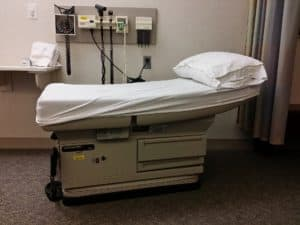

One of the idiosyncrasies of the American healthcare system([and there are many](https://thrivingwhiledisabled.com/the-us-healthcare-system-is-broken/)) is that it’s somewhere between difficult and impossible to get much information about how effective your doctor is.  There are some indicators out there, but it’s mostly second-hand information.

For example, if your doctor was involved in a malpractice lawsuit, it’s generally a bad sign, but not having been sued doesn’t prove if they are a good doctor, only that nobody has legally accused him or her of making extremely poor decisions.  

Also, there aren’t records generally available about how often they have made certain diagnoses, nor how often those diagnoses were correct.

So, as patients, we are left with several imperfect ways to try to determine if our doctors are really doing the best they can for us, and on a similar note, it’s hard to know if there’s a better option out there, just waiting to be found.  

The main thing to remember is that you **can** change doctors. You have the right, and the ability, to stop seeing any doctor that you have, and to [seek out a better doctor for you](https://thrivingwhiledisabled.com/doctor-shopping/).

There is no shame in that, and, while it can feel like a daunting process, it’s better than staying with a doctor who isn’t helping you.  That said, seeing **a** doctor is generally better than seeing **no** doctor, so please do not use this as a reason to stop seeing doctors altogether.

## Where to get your information

If you are trusting doctor’s website information, please stop doing that.  Any website for any individual or organization may slant information in their favor.  

<figure>

_Research is an essential part of your decision-making process_

</figure>

It only makes sense.

If they are paying for it, they want it to portray themselves in the best possible light.  

If you want to know about what a doctor(or organization) says they can do, look at their site, but if you want an evaluation of how well they do something, you need to use independent sources.  

For doctors, there are a few options. To know what prior patients of the doctors have to say, [Healthgrades](http://www.healthgrades.com) is one of several good resources.  You should be able to find more with a quick google search such as ‘doctor review sites’.  

Also, most [insurance companies](https://thrivingwhiledisabled.com/health-insurance-what-are-my-options/) have a similar system, but only for their members(and participating doctors).  

To look at that, just log onto your insurance company’s site and run a search for your doctor. You should see a rating(1-5 stars, 5 being best), and what other patients have said of her or him.  

Remember though, this is all opinion-based. Just like any other rating and review site, the fewer reviews the lower the accuracy of the information, and it is always possible for at least some of the reviews to be fake.  

Also, remember that human nature being what it is, people are much more likely to recount exceptional experiences, so their worst or best doctor experiences are likely to be shared, not their average ones. Still, the opinion of many consumers is one of the better metrics available.  

[To dig more into your doctor’s history,](https://thrivingwhiledisabled.com/doctor-shopping/) you can search for a history of malpractice suits.  Do a google search for “medical licensing board” with your state’s name.

From there it should be relatively easy to find the doctor directory and search up your doctor.  That information should include information about the average number of malpractice suits for their discipline.

In this case, being below average is a good thing. Bear in mind that this information does not always cross state lines with the doctor and that it is possible to be involved in a malpractice lawsuit without having done anything wrong.  

## How do you feel about your doctor?

The most important opinion, of course, is yours.  Do you trust your doctor?

If the answer is no(unless immediately followed by ‘I don’t trust ANY doctors), it’s time to consider a new doctor.  

If you feel ignored or dismissed by your doctor, it’s time to consider a new one.

If you are taking medication, but your doctor didn’t tell you why, it’s time to consider a new doctor.

If you can’t comfortably ask your doctor medical questions, either [you need to figure out how, or you need to find a new doctor](https://thrivingwhiledisabled.com/building-a-partnership-with-your-doctor-good-doctor-patient-communication/).  

I know that evaluating your doctor might feel uncomfortable, especially if you have been seeing him or her for a long time, but it is important.

While a doctor is better than no doctor, you deserve more than that.

You deserve to see the right doctor in the right practice for you.  

## Thinking about your experience at the office

So what do you look for at the doctor’s office, to help you decide if you’re seeing the right doctor for you?  

The above information helps you know how other people have experienced your doctor, and the malpractice history can help you see a little bit about if your doctor has a history of making severe mistakes in his or her practice, and how comfortable you feel talking to your doctor is vital.  

But if you’re still questioning things, or wondering if you are somehow at fault for your doctor’s lack of response or lack of information, here are more considerations.

## How functional is their office?

When you call the doctor's office, does your call get answered right away?  Is there a long electronic message? Are you put on hold? If so, for how long, and how frequently?  Once you do talk to somebody, how far off is your actual doctor’s appointment?

There is a tendency in many offices to have electronic greetings, which is all well and good.  A bit annoying, in my opinion, but it does make sense, because there are some simple questions, like location, that you don’t really need a person for.

And medical emergencies really do need to be handled by 911, and I guess there might be some people out there who automatically call their doctor’s office.  

If it takes more than 5 minutes or so to get through to a person, though, how well-managed is that office, really?

First thing in the morning or at the end of the week, it might be a bit hectic, but otherwise? You deserve to get through and talk to a real live person. If you don’t, then how can you communicate your need to be seen by your doctor?  

Once you do get through to a person, how responsive are they, and how quickly do you get in?  

If you’re calling due to an illness that just won’t go away, seeing the doctor next week isn’t very reasonable(unless you’re calling too late on a Friday afternoon to get fit in, in which case it’s possible you need to wait until Monday).  

When you’re urgently ill, they should be able to fit you in within a day or two(same day if you call first thing in the morning, next day is acceptable if you call after 11 or noon.) You do need to be willing to take whatever time they have, but going in should be quick.  

If you’re dealing with a physical or something similar, waiting a week or two is acceptable, but waiting over a month isn’t.

My partner and I knew it was time for him to change doctors when each time he called for an appointment, he couldn’t be seen for over a month.

The final straw was when his long-awaited appointment occurred during a snowstorm, and they forgot to call him and let him know the office was closed.  

When he reached them, they rescheduled him to come in **two months later**. He had already seen a new doctor by then, and we haven’t looked back.

## In the waiting room

Is the waiting room usually full?  Usually empty?

<figure>

_An empty waiting room might mean your doctor is very efficient...or very unpopular!_

</figure>

Either one could be a bad sign.  

If it’s full, and you typically wait more than 30 minutes to be seen by your doctor, it’s time to move on.  This is a big indicator that the office is typically overbooked, and you deserve better treatment.

The only exception I see is if the doctor runs late because she or he is very attentive to patients, and talks with them as long as needed.  

In that case, either the doctor or office has poor time management skills, but might still be worth seeing, as long as you know that you will be getting that treatment when you finally get in.

If that is the case, just acknowledge that that is how that office works, and allow plenty of extra time for your appointments.  

One of my doctors was like that. He is a neurologist(one of those [specialists](https://thrivingwhiledisabled.com/seeing-a-specialist/) that is very tough to get into), and I would sometimes wait for hours to see him.

He was in Manhattan, so it would also take me a couple of hours to get there.

[I planned those days entirely around him](https://thrivingwhiledisabled.com/pre-planning-to-get-the-most-out-of-your-day/), sometimes making plans before his appointments(which were always in the afternoon) and would often seek out an interesting restaurant to try as a reward for making the trip afterward.

If the waiting room is typically empty, that could indicate that they have few clients or their office is run with high efficiency.  

If every time you come in, there’s nobody else there, it looks like that doctor has fewer patients than he or she should have, or has managed in the past.  

If it feels like a pretty precise schedule, where you get in and the patient before you is waiting, but nobody else, it’s more likely that the office is run efficiently and the office is able to anticipate the schedule well.  

In many cases, multiple doctors share the space, so you can tell how the practice is doing, as opposed to the individual doctors. In that case, if you are unhappy with your doctor, but not the practice, try to get yourself scheduled with another one of the doctors to see how they compare. 

If you like a different doctor better, just start scheduling with them instead, it is one of the easier ways to make the shift if the practice seems good.

The other positive is that you would not need to worry about getting your records transferred, or any of the other work that goes with changing [Primary Care Physicians(PCP’s](https://thrivingwhiledisabled.com/selecting-a-primary-care-physician/))

## In the examination room

<figure>

_Exam room_

</figure>

In the examining room, the nurse should take a reasonable history.  

You should go over why you are there, any conditions you have, what medications you take, and they should also take your height, weight, and other vitals(blood pressure, heart rate, and usually temperature).  

If they skip any of these steps, that’s a red flag. If you need to disrobe at all, the nurse should tell you that and give you the appropriate covering before he leaves.

A wait of several minutes is pretty normal, so don’t let that bother you.  

Once the doctor does come in, she should use your name(your information should be hung on the door to the examining room, or otherwise easily available to the doctor), so they are sure they are in the right room with the right patient, and they should introduce themselves.  

They will usually ask what brought you in but should have a general idea from the nurse’s notes.

After they complete the exam and discuss your symptoms with you, they should have either a [diagnosis](https://thrivingwhiledisabled.com/how-doctors-recognize-and-treat-medical-conditions/) or next steps for you.

If you are in for cold or flu symptoms, or a similar illness, they will determine if you need antibiotics.  For something more complicated, further tests are often in order.

<figure>

_Medication is only necessary sometimes - if it's needed, make sure that you take the full dosage for the full amount of time_

</figure>

By the time the doctor leaves the exam room, though, you should have some closure.

You should know what you have, or what your next steps toward finding out are, and you should know if/when you should see the doctor again.

These pieces together are often referred to as your [treatment plan](https://thrivingwhiledisabled.com/your-treatment-plan-a-powerful-tool-for-your-wellbeing/).

Unless otherwise told, you likely just need to get dressed, gather up your things and head out at that point.  

Be sure to get your prescriptions at the desk when you check out - that’s also where you should be scheduling your next appointment.

If any of these things fail to happen, and you are left in your room confused about your next steps, it’s time to search for a new doctor.

When they explain what they found, they should be willing to answer any questions you have, and they should be able to explain why you need the medication or testing.  

If they don’t, it’s time to look for a new doctor or work on your self-advocacy skills.

## Your decision after evaluating your doctor

If your doctor sets off no red flags for you, hopefully, this has reassured you on your choice of doctor.  

You now have some things to keep an eye out for, but you can reassure yourself that you have chosen well(or gotten lucky), and don’t need to worry so much about if this doctor is right for you.  

If, on the other hand, you feel that you have the wrong doctor, then [it’s time to start searching for a replacement.](https://thrivingwhiledisabled.com/selecting-a-primary-care-physician/)

Remember that you have every right to do so, and it is the correct step for your mental and physical health.  If you do feel you need to change doctors, your next step is to find a new doctor, and see how that one fits.

It is always best to find the new doctor before firing the old one, so you can avoid discomfort and awkwardness if you need a doctor before you’ve found a new one, or worse if you discover they are currently the best of bad options(which may mean it's time to [re-evaluate your health insurance](https://thrivingwhiledisabled.com/health-insurance-what-are-my-options/)).  

You can and will find your right doctor, and you deserve to have a doctor you can trust, and who will help you stay educated about the health conditions you face. Finding, and keeping, the right doctor is an essential part of your health care.
