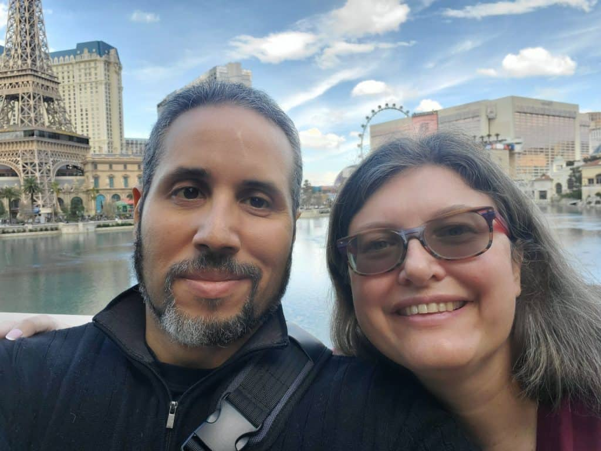

It's been a week since our new president has been sworn in. And just as many of us(including me) have feared, things are decidedly NOT "business as usual".

There are always is a certain amount of hand-wringing and anxiety around a change in presidency, especially when it also is associated with a change in party. Often, it at least partially is an exaggeration of the possibilities, and the system of checks and balances that keep our democracy in place prevent the worst(and sometimes best) of possibilities.

This is NOT what has happened this time; people have been sounding warnings about this possibility for a long time. To all the people who voted for our current president anyway: we warned you(search the hashtag #FAFO for more). To all of the democrats who stayed home, instead of voting for a black, female president: how dare you?? You contributed to this mess too, by not showing up and defending our future. I understood the assignment, as did my family.

## Understanding some of the changes in the past week

I cannot overstate that the rate of change is dramatic and terrifying. I also want to acknowledge that I cannot list all of the sweeping changes, the damage they include, and the ramifications that they will have on this country as a whole. What I can do, though, is outline what I'm aware of and the ramifications that accompany them on my life and how I anticipate they will impact fellow disabled people.

#### Changes to the White House Website and Government Agency Information Sharing

The moment Trump was sworn in, the changes started. The White House website immediately underwent a few significant changes. The more significant ones included the removal of Spanish and sign language from the website. Everywhere where historically there had been translations no longer had them available. Here's one [description](https://www.cbc.ca/news/world/trump-changes-websites-1.7440915) of the changes. The constitution was also removed from the website, and most, if not all, references to Diversity, Equity, and Inclusion on all government websites.

While there often are some changes to the White House website when a new president is sworn in, usually they are directly related to the identity of the president, while the rest of the site is more slowly adjusted as changes occur. Instead, this was a sweeping removal of an interesting variety of information, sending a strong message: we don't care about accessibility, and we don't want to focus on people who aren't already in power.

Since the website changes, our president has also made additional moves to minimize access to important information and to defend the rights of minority identities. Many medical and science-related institutions have been instructed [not to send out](https://www.msn.com/en-us/politics/government/trump-orders-blackout-at-cdc-fda-nih-as-agencies-prepare-for-maga/ar-AA1xF5Et) their standard weekly updates or advisories, or any other information for that matter. NO details have been shared about when that may change. This is not normal. These are reports that have continued, uninterrupted, since they started, many more than 50 years ago. Normally things like a change in presidency has no impact on their work.

Also, all government employees whose work is related to diversity, equity, inclusion, and access [have been put on administrative leave](https://www.cnn.com/2025/01/21/politics/white-house-government-dei-employees-on-leave/index.html), in anticipation of a mass firing. Again, this is so far from normal, I'm not even sure how else to describe it.

#### Who is being empowered? Who is being attacked?

Elon Musk is the new head to the newly created Government Efficiency Department. He gave a [Nazi-style salute](https://www.newsweek.com/musk-germany-salute-nazi-2019503) to an excited crowd. The people involved in the January 6th attack on our democracy last election [have been pardoned](https://www.aol.com/trump-planning-pardon-nonviolent-january-192408149.html). Again, mass pardons and sentence commutations is not exactly part of the standard for how the government is run.

ICE has increased the number and severity of raids dramatically nation-wide, and military planes full of noncitizens are being flown back to their country of origin. They have not been treated well. Colombia is one of many countries that [had people returned](https://www.nytimes.com/2025/01/26/world/americas/colombia-us-deportation-flights.html), and did not appreciate the gesture, to put it mildly.

With the removal of all things [DEI/DEIA](https://www.whitehouse.gov/presidential-actions/2025/01/ending-radical-and-wasteful-government-dei-programs-and-preferencing/), the president is clearly signaling that he does not care about minorities and wants to maintain power for white people. He has talked with and freed many White Nationalists, strongly indicating that he agrees with their goals and ideals.

Noncitizens are being targeted and scapegoated, reinforcing the messaging of white power, since the targeted noncitizens are generally Latino.

By creating a communications blackout from the CDC, NIH, and other medical and scientific government sources, he is also signaling a lack of concern for the health and welfare of anybody who is, or may become, ill. So, the disabled population is at least doubly targeted(as both a minority identity and people with health issues), not to mention the fact that many disabled people are already multiply marginalized.

While he has made attempts to deprioritize Medicaid and Medicare coverage, so far most of the laws around those programs remain intact. I do not know how much longer that will last. He did repeal [Biden's executive order](https://www.newsweek.com/donald-trump-medicare-executive-order-explained-2018138)s related to Medicare coverage, which may undo some of his work towards lowering medication costs.

## Impact on my book

After the election results were in, my editor and I met to discuss the impacts this would have on my book, and what to do about it.

We agreed that there was a possibility of my book being incredibly outdated by the time it was published in April, because we both were very concerned that many of the programs I discussed would have their funding reduced still lower and may not be able to continue to provide support, and I was even more afraid (though I thought the possibility less likely) that programs I (and many others) depend on to survive might be entirely dismantled, defunded, or simply removed from existence.

I hoped that I was catastrophizing, but I know that historically, I have not had this reaction to a change in leadership, Even with this being my first book, my level of fear and anxiety were much greater than if this was anything like historical changes in presidency.

<figure>

![Brick wall with a red box labeled "In case of emergency break glass" Behind the glass is Alison's book. The cover has a strong turquoise background with white text that reads "Thriving While Disabled" one word per line across the top. The word "while" is a subtly different shade, more of a light blue, than the other words, and is slightly smaller with matching light blue lines above and below it. Below that the words "Navigating Disability Finances" are slightly smaller with one word per line, all on the left margin. To the right is the image of a white labyrinth with two different colored lines(one a dark reddish brown, the other a dark blue) running through it, each starting on the outside and ending in the middle. Slightly below this, a white line crosses the page, with the name "Alison Hayes" printed underneath in the same very light blue color as the word "while".](images/TWD-mockup-10-1024x1024.png)

<figcaption>

This book should be very helpful, and our need of support is getting more and more urgent

</figcaption>

</figure>

I remember texting my therapist about my concerns, and her reply wasn't "you're overreacting" but simply "it will take time to dismantle these systems". I hope she's right. But I'm seeing a lot of other systems that people depend on already dismantled in this first week, so I'm feeling quite justified in my fear.

After some consideration, I didn't scrap my book. I also didn't give up. What I did instead, was pivot a little so that I was using my knowledge of the US system as a model and my book as a whole to discuss the global issues related to disability. It still has all of the information I've been talking about in it, what programs exist, how to use them, what to expect with them. But I've added in some information on other systems in other countries, and the universality of these struggles. The US is by far the worst when it comes to straight up medical expenses, and I've discussed the ways I'm aware of for us to mitigate the damage that that causes.

But all countries have medical ableism, where doctors presume that life is more valuable if you aren't disabled, and wheelchair accessible anything is less common. All countries have lower employment rates for people with disabilities when compared to abled people. All countries have some degree of challenge around making spaces accessible and enforcing the rights of people with disabilities. Recognition of disabled people as a minority identity is relatively new(or hasn't happened yet) and the same goes for government protections of disabled people. Most countries have major blind spots when it comes to the rights of people with disabilities.

So I've focused on that universality of experience, and pulled from my life experience and the experiences of other disabled people I've spoken to, no matter where they live. And that is the heart of my book: Disability is a minority identity, and we are facing discrimination based on having disabilities, no matter what they are. We deserve equal treatment, and we deserve to thrive - and the book is full of tools to help you reframe your experiences, anticipate the challenges, and take care of yourself even though this discrimination is so severe and can make our lives so very challenging.

I'm still afraid that most of the program-related information is going to be inaccurate by the time the book is published. I'm going to create a page on my website that links you to the many resource links I do have in my book - and my plan is to add more links and updated information through that site as things change(or at least do my best to keep things updated).

If you would like the book, it's available for preorder now! Kindle format only is available for preorder here: [https://www.amazon.com/dp/B0DQPL1VWV?ref\_=pe_93986420_775043100](https://www.amazon.com/dp/B0DQPL1VWV?ref_=pe_93986420_775043100)

The book can also be preordered in hardcover, paperback, or Nook here:  [https://www.barnesandnoble.com/w/thriving-while-disabled-alison-hayes/1146706980?ean=9798991839532](https://www.barnesandnoble.com/w/thriving-while-disabled-alison-hayes/1146706980?ean=9798991839532)

This is simply a scary time to be an American, and I want to make sure that I acknowledge that, and help other folks with minority identities know that they are far from alone in that fear.

## Impacts on my personal life

I am an American citizen, as are all members of my family. My partner Al's parents immigrated here from Colombia before he was born, and while they are also citizens, they are bilingual and first-generation citizens.

Al and I moved in with his parents in November, after our landlord decided he needed to remodel his building so his daughter could move in. We'd been there for over 10 years and the rental price was very reasonable. Part of why we moved in was financial, but we also moved in because his father had a heart attack in July of last year, and needed some extra support around the house.

My book has been my biggest financial investment in my business, and I've devoted most of my energy to it for the better part of the past year. And now I'm afraid that the change in government will make selling my book harder, and may change many programs that have been around for six decades or so!

I'm a bit terrified about this change in administration and have been very concerned about it since the first inklings occurred. I've known from early on that this presidency would be much worse than last time, and while I'd felt unsafe last time, I didn't experience major damage as a result of his presidency.

I'm now a legally single white woman living in a Latino, spanish-speaking household, and one of three whose financial support is almost entirely from Social Security. We are at high risk of being targeted for that alone. So far, we seem to be okay, but I'm very concerned about the physical and emotional safety of this household.

<figure>

<figcaption>

No matter what, I'm fighting to keep my family free and safe

</figcaption>

</figure>

On top of that, I'm part of the queer community, as are several members of my extended family. So far the attacks on the LGBT community have primarily been towards trans people, and I have multiple trans friends in my life orbit. I'm very concerned for their safety, and anticipate that things are going to get even worse.

We heard about multiple ICE raids in our area, including them holding a military veteran who showed service ID. I'm very concerned about Al or his parents being harassed for being brown and speaking Spanish.

I'm very concerned about the future, and fear that things are only going to get worse. I'm going to do my best to keep going and make the book happen anyway (there's a lot in it that's still highly relevant and useful even if every program changes dramatically).

I'm mostly tracking the news, but it's been pretty overwhelming, so I'm making sure to just give myself news-free time as well - I spent the better part of Friday curled up in bed reading, specifically so I wouldn't hear too much about the new ways that our president is damaging the fabric of our country.

I am very intentionally avoiding using his name, as he only seems to pay attention to things with his name on it. I simply don't want to regress to name calling, and I don't want to give him any more publicity.

I just want to send a message of solidarity out to all my fellow minority identities: you are not alone, and we are stronger together. I'm doing my part to live out loud, and share the resources that will help myself and my community. I will not stop doing so. I will not back off and I will not deny my identity. I want us all to succeed and survive, despite our government actively working against our best interests.
