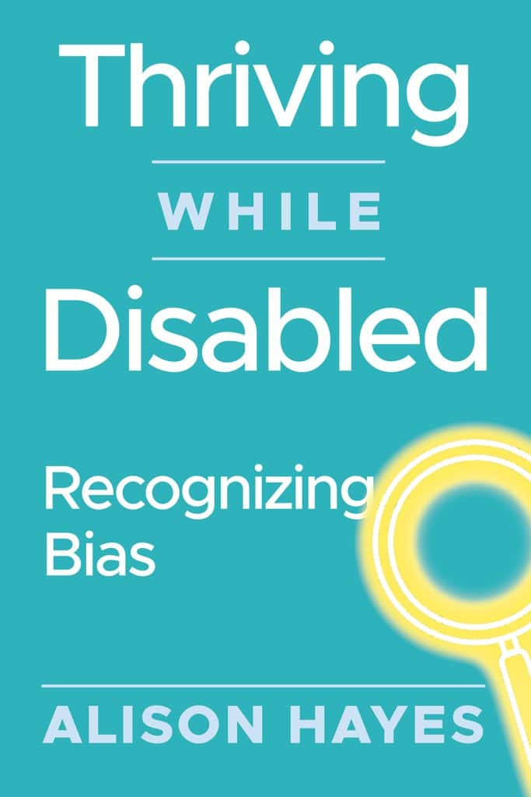
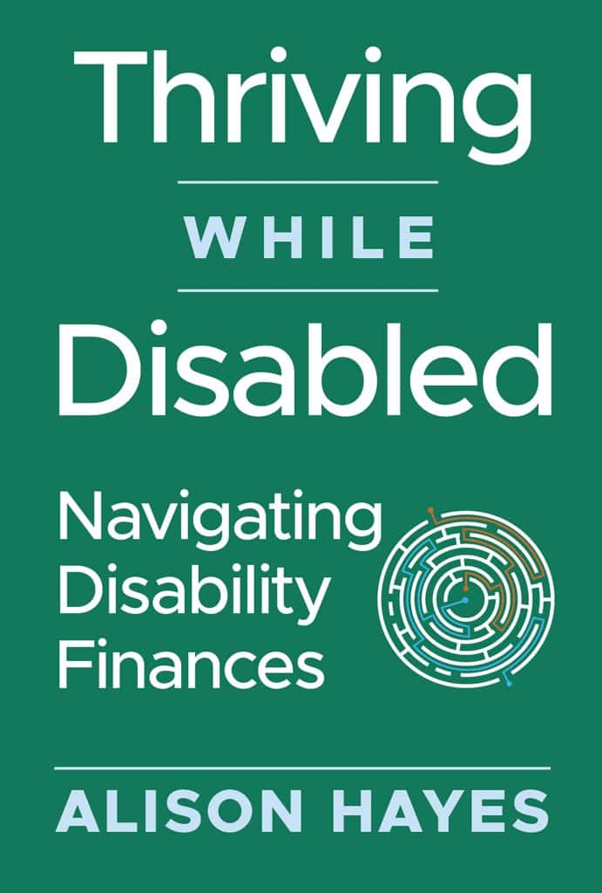

About 2 weeks ago I discovered that I had written a LOT more than I realized. While writing and editing, I was struggling to navigate the gigantic document I have, and I discovered a feature on Google which allowed me to divide the book into a collection of separate tabs, which I could move around in the document as needed, and minimize when I wasn't working on them. It made editing sections and moving sections around so much easier. But there was a catch, which we didn't realize until the copyediting process moved forward: tabs prevented us from having an accurate word count. I was encouraged on several occasions to write as much as I needed to describe situations and solutions, so I did. The difficulty with that is that, as you might be able to tell, I tend to have a lot to say. So, we had counts for some of the longer tabs, but I had 100 tabs(the maximum) in this document.

When the copyeditor pulled everything out of tabs, we discovered that instead of writing something like 40-80,000 words(70,000 words is on the long end of a typical self-help book), I had actually written almost 185,000 words!! This is more like the length of an epic fantasy book.

So I had to take a step back, and think about things. I could have cut out large chunks of what I had written, but I knew I hadn't put fluff in there and the whole book was written with the goal of supporting people through tough processes, and I didn't want to take away from that.

I also couldn't afford a copyeditor for that much writing. So I asked around a bit, had some great conversations, made a plan...and then changed it again. I sent out a message to my email list(if you didn't get an email asking your opinion on Thriving While Disabled: Navigating Disability Finances in the last couple of weeks, you're not on my list, please join [here](https://bit.ly/NavDisability)), shared messages on my [Facebook group](https://www.facebook.com/groups/thrivingwhiledisabled)(if you didn't see it, please check if you're a member), and generally looked for advice within the community.

After deciding to publish a single book in two volumes, I realized that I was actually publishing the first two books in a series!

In the meantime, I had an amazing woman in the writing group I'm part of **volunteer** to do both developmental and copyediting on my document. Developmental editing is the work to shorten, streamline, or otherwise help the author to better communicate with the audience. Copyediting is the correction process of making sure that there aren't spelling, grammatical, or punctuation errors in the document.

<figure>

<figcaption>

Screenshot

</figcaption>

</figure>

So, without further ado, I'm introducing you to my books, which will be published on May 12, 2025: Thriving While Disabled: Recognizing Bias AND Thriving While Disabled: Navigating Disability Finances.

Thriving While Disabled: Recognizing Bias is the first book, and it will give you a deep understanding of what it means to be disabled, and look at life through the lens of disability. In Thriving While Disabled: Recognizing Bias, we'll discuss the intersection of disability and poverty, disability as a minority identity, and the risks that come with these concerns. The book will also explore disability history and what individuals with disabilities can expect as they hit life milestones, like receiving an education, transitioning into adulthood, considering marriage or children, and simply existing in the first place. This book will be especially useful for newly disabled folks or the family members of people with disabilities to understand the challenges faced and the costs and risks involved in being or becoming disabled, as well as resources to help manage them.

Thriving While Disabled: Navigating Disability Finances is a deep dive into why many disabled people are or become poor, with detailed information on how to protect yourself from becoming a statistic. Whether you're newly disabled or have been living with a disability a long time, this book will have content to help you protect yourself as you take the steps necessary to keep going and improve your quality of life.

I've identified many of the key points where having a disability changes your interactions with the rest of society, and each chapter walks you through how to evaluate the situation, protect yourself, and find a useful solution. Whether it's protecting employment, applying for benefits, finding housing, or simply being prepared for using public transit, I have committed to laying out what is likely to be available, suggestions on considerations you might need, and advice on finding additional information that may be beyond the scope of this book. I'm actively giving you the vocabulary, concepts, and starting points that will lead you to finding your solution more efficiently and effectively, while reducing your stress about how to handle the challenges you face. I also have checklists or other guidance for each chapter, and an information resources list to help you get more details or have useful points of comparison.

I also want you to know that this guide also recognizes that ableism is really a global issue. Every chapter in both books acknowledges the universality of ableism. When specific laws, regulations or programs are discussed, I go in detail about the US laws, as that is what I know intimately, but I make a point of prefacing that with a comparison to how these issues or concerns are handled in other countries, referencing some specific examples to make a point of comparison. My hope is that people in other countries will also use this series as a guide to help them through their processes as well.

I also acknowledge that there are ongoing severe changes happening here in the US on a daily basis. Programs are being defunded and dismantled at an alarming rate. The Disability Finances book itself will only be accurate as of January 19, 2025 for obvious reasons, but I have been tracking the major changes. Once you purchase the book, you'll have access to a webpage where I track changes to the programs discussed within as well as a space for all the links from the books(and likely extra details as I find them). I'm doing my best to keep things accessible and simple for everyone. We are living in difficult times. I belive that these books will help you to navigate them.

With the first book, you'll be able to adjust your perspective, have a deeper understanding of ableism in its many forms, and the challenges you have or are likely to face as you continue to live with your disability identity. The second book will help you use that understanding to help yourself survive, then thrive, in a world that wasn't designed for you.

I apologize for the delay, and hope that you find both books useful in your life journey!

\-Preorder [Thriving While Disabled: Navigating Disability Finances](https://www.amazon.com/Thriving-While-Disabled-Navigating-Disability-ebook/dp/B0DQPL1VWV/ref=sr_1_1?crid=20PFYH6D0ANIP&dib=eyJ2IjoiMSJ9.Rt7rsbBgPTF2J8_PMFwpvb-sttIAARTFxw3_HtVMZf4.ve5wFTwiIXoBEG0-TLx-fN1SmIuzfqYQ3xHseTnBRgI&dib_tag=se&keywords=thriving+while+disabled+alison+hayes&qid=1745424860&sprefix=thriviing+while+disabled+alison+hayes%2Caps%2C604&sr=8-1) from Amazon. It will be available May 12, as announced!

\-Preorder [Thriving While Disabled: Recognizing Bias](https://www.amazon.com/Thriving-While-Disabled-Recognizing-Bias-ebook/dp/B0F5WC3VDW/ref=sr_1_2?crid=20PFYH6D0ANIP&dib=eyJ2IjoiMSJ9.Rt7rsbBgPTF2J8_PMFwpvb-sttIAARTFxw3_HtVMZf4.ve5wFTwiIXoBEG0-TLx-fN1SmIuzfqYQ3xHseTnBRgI&dib_tag=se&keywords=thriving+while+disabled+alison+hayes&qid=1745423926&sprefix=thriviing+while+disabled+alison+hayes%2Caps%2C604&sr=8-2) from Amazon. It will be available May 17th(apologies for the delay, but we had to publish Volume II first due to Amazon's rules on changing dates)

\-Preorder [Thriving While Disabled: Navigating Disability Finances](https://www.barnesandnoble.com/w/thriving-while-disabled-alison-hayes/1146706980?ean=9798991839532) from Barnes and Noble. It will be available May 22(apologies for the delay, but Barnes and Noble needs a full 10 business days between upload and publication)

\-Preorder [Thriving While Disabled: Recognizing Bias](https://www.barnesandnoble.com/w/thriving-while-disabled-alison-hayes/1147319575?ean=9798991839587) from Amazon. It will be available May 29th(apologies for the delay, but Barnes and Noble needs a full 10 business days between upload and publication AND we had to publish Volume II first due to Amazon's rules on changing dates)

It takes time to get things right. Publishing these books has been a series of lessons in humility, inner strength, and mental flexibility. I still believe that it will be worth all the effort and delay, and cannot wait for you to read them!
